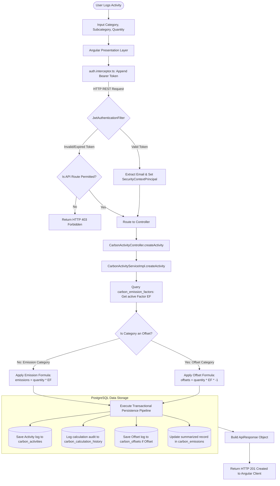

# EcoTrack: Carbon Footprint & Sustainability Management Platform

EcoTrack is a modern, gamified, full-stack sustainability management application that empowers individuals and organizations to calculate, track, and offset their carbon footprints. It provides interactive sustainability scorecards, custom goal-setting trackers, community challenges, and real-time AI-powered recommendations.

---

## Project Architecture

EcoTrack is built using a decoupled three-tier architecture that guarantees a clean separation of concerns between the presentation layer, the business logic layer, and the persistence layer.



### Calculation Formula Reference

The platform dynamically calculates footprints based on the category type:

* **Carbon Emissions (Gross Carbon Cost):**
  $$\text{Emissions } (CO_2e) = \text{Logged Quantity} \times \text{Factor Value}$$
  *Example (Transportation):* Logging 10 miles in a petrol car:
  $$10 \text{ miles} \times 0.35 \text{ kg/mile} = 3.50 \text{ kg } CO_2e$$

* **Carbon Offsets (Green Carbon Reduction):**
  $$\text{Offsets } (CO_2e) = \text{Logged Quantity} \times \text{Factor Value} \times (-1)$$
  *Example (Tree Plantation):* Planting 2 trees:
  $$2 \text{ trees} \times 22.00 \text{ kg/tree} \times (-1) = -44.00 \text{ kg } CO_2e$$

* **Net Carbon Score Calculation:**
  $$\text{Net Footprint} = \text{Total Gross Emissions} - \text{Total Offsets}$$

### Presentation Layer (Angular 19 Standalone)
The frontend functions as a stateless Single Page Application (SPA) responsible for rendering dashboards, scorecards, charts, and input forms.
* **Component Design:** Utilizes Angular standalone components to reduce boilerplate. Views are modularized into feature directories (auth, carbon, challenges, dashboard, goals, reports, profile).
* **Security Interceptor:** A global Angular HTTP Interceptor (`auth.interceptor.ts`) automatically intercepts outgoing requests to the backend API (`/api/`) and appends the user's JWT token in the `Authorization: Bearer <token>` header if they are authenticated.
* **State Isolation:** Services (e.g., `ActivityService`, `GoalService`) isolate business operations and API consumption away from view components.

### Business & Calculation Layer (Spring Boot & Java 21)
The backend functions as a secure REST API gatekeeper, handling data processing, token validations, and footprint calculations.
* **Security Context:** Incoming requests are routed through a stateless Spring Security filter chain. The `JwtAuthenticationFilter` validates the bearer token (or decodes local mock tokens in test environments) and populates the `SecurityContextHolder` with the authenticated user's principal.
* **Calculation Engine:** Automates emissions and offset processing. When an activity is logged, the `CarbonCalculationService` queries the emission factors table, calculates the carbon impact ($\text{Calculated CO}_2\text{e} = \text{Quantity} \times \text{Factor}$), logs the mathematical formula in the audit table (`carbon_calculation_history`), and saves the activity.
* **AI Integration:** The `AIService` reads live carbon summaries and category scores, formats them into a structured prompt, and interfaces with OpenRouter to query large language models (such as Gemini) for target sustainability advice.

### Persistence Layer (PostgreSQL)
* **JPA & Hibernate:** Manages ORM mappings.
* **Automatic Seeder:** A `CommandLineRunner` automatically seeds structural categories, community challenges, active emission factors, and test user profiles on startup if they do not exist.

---

## Codebase Structure

### Backend Layout
```text
Backend/
├── src/main/java/com/ecotrack/backend/
│   ├── activity/                  # Carbon Logging Domain
│   │   ├── config/                # CarbonActivityDataSeeder
│   │   ├── controller/            # Activity categories, records APIs
│   │   ├── dto/                   # Activity payloads
│   │   ├── entity/                # CarbonActivity, Category, Factor, Offset, CalcHistory
│   │   └── repository/            # JPA Data Access Interfaces
│   ├── controller/                # User, Challenge, Goal, AI, and Dashboard controllers
│   ├── dto/                       # Login and Registration payloads
│   ├── entity/                    # User, Challenge, Goal, CarbonEmission, ChallengeProgress
│   ├── repository/                # UserRepository, GoalRepository, ChallengeRepository
│   ├── security/                  # SecurityConfig, JwtAuthenticationFilter
│   ├── service/                   # GoalService, ChallengeService, AIService
│   └── utils/                     # JwtUtil, PromptBuilder
└── src/main/resources/
    └── application.properties     # DB settings, Server Port configuration
```

### Frontend Layout
```text
frontend/
├── src/app/
│   ├── core/                      # Services & interceptors utilized globally
│   │   ├── guards/                # AuthGuard, AdminGuard
│   │   ├── layout/                # Navbar component and side panel navigation
│   │   └── services/              # Auth Interceptor and shared services
│   ├── features/                  # Standalone feature route components
│   │   ├── ai/                    # Eco-AI Chat Assistant
│   │   ├── auth/                  # Login & Registration views
│   │   ├── carbon/                # Carbon Tracker Activity form logging
│   │   ├── challenges/            # Weekly community challenge cards
│   │   ├── dashboard/             # Admin, Individual, and Org dashboard panels
│   │   ├── goals/                 # Reductions Target CRUD lists
│   │   ├── profile/               # User Settings & Badges earned
│   │   └── reports/               # Graphs and reports details
│   ├── app.component.ts           # Root module component
│   └── app.routes.ts              # Route mappings
```

---

## Installation & Configuration

### Prerequisites
* **Java SDK 21** or higher
* **Node.js** (v18 or higher) & **npm**
* **PostgreSQL Database** running locally

---

### Step 1: Database Setup
1. Open **pgAdmin 4** or your preferred PostgreSQL client.
2. Create a new database named `ecotrack`.

---

### Step 2: Backend Environment Variables
Create a `.env` configuration file inside the **`Backend`** folder (`Backend/.env`) to store your local database credentials:

```env
# Backend/.env
DB_URL=jdbc:postgresql://localhost:5432/ecotrack
DB_USERNAME=postgres
DB_PASSWORD=your_postgres_password
JWT_SECRET=EcoTrackSuperSecretKeyForJWTAuthentication2026!
OPENAI_API_KEY=your_openrouter_api_key_here
```

---

### Step 3: Run the Backend Server
Open your terminal, navigate to the `Backend` folder, and compile/run the application:

```bash
cd Backend
.\mvnw.cmd spring-boot:run
```
*Note: Hibernate will automatically create all tables and compile the database on port `8081`. The seeder will automatically insert initial categories, challenges, and demo user data.*

---

### Step 4: Run the Angular Frontend
Open a new terminal, navigate to the `frontend` folder, install dependencies, and start the local development server:

```bash
cd frontend
npm install
npm start
```
The Angular web application will launch and listen locally on port `4200` (`http://localhost:4200`).

---

## Seeded Demo Logins

You can login immediately to explore the platform using the following accounts:

### 1. Administrator Account
* **Email:** `demo@ecotrack.com` (or `demo@gmail.com`)
* **Password:** `password123`
* **Features:** Access to Admin Panel, emission factor configuration, and challenge creation.

### 2. Standard User Account
* **Email:** `user@ecotrack.com`
* **Password:** `demo123`
* **Features:** Standard individual sustainability metrics dashboard, goals CRUD, and logging panel.
